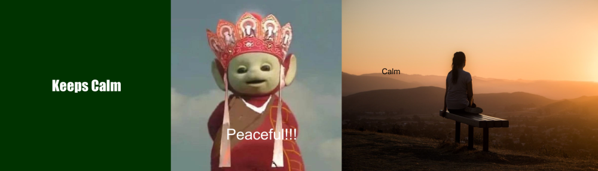

# Kia ora te ao!

Welcome to my Assiggment website! 


Below is a buddha I made using the R package [{magick}](https://cran.r-project.org/web/packages/magick/vignettes/intro.html).



A really short and unhelpful summary of my inspiration for the buddha is:

1. I interested on it.

I also probably should provide the `R` code I used to make the meme!

```

library(magick)

backdrop<-image_blank(width = 600,height = 600,color = "#003300") %>%
  image_annotate(text = " Keeps Calm",
                 color = "#ffffff",
                 size = 50,
                 font = "Impact",
                 gravity = "center")
backdrop
Teletubbies<-image_read("https://gimg2.baidu.com/image_search/src=http%3A%2F%2Fimg.2qqtouxiang.com%2Fpic%2FTX9978_02.jpg&refer=http%3A%2F%2Fimg.2qqtouxiang.com&app=2002&size=f9999,10000&q=a80&n=0&g=0n&fmt=auto?sec=1650354145&t=929c18b589cd8d59a4be6cdc4dc1424a")
Teletubbies<-image_annotate(Teletubbies,"Peaceful!!!",color = "White", size=60,location = "+220+500")
Teletubbies<-image_scale(Teletubbies,"x600")
print(Teletubbies)

calm<-image_read("https://cdn.tatlerasia.com/asiatatler/i/hk/2020/04/05042901-sage-friedman-hs5clnqbcoc-unsplash_cover_1920x1280.jpg")
calm<-image_annotate(calm,"Calm",color = "black",size = 60,location = "+300+500")
calm<-image_scale(calm,"x600")
print(calm)

meme<-c(backdrop,Teletubbies,calm)%>%
  image_append((stack=FALSE))%>%
  image_scale(1000)
meme
image_write(meme, "my_meme.png")
```
